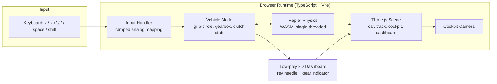
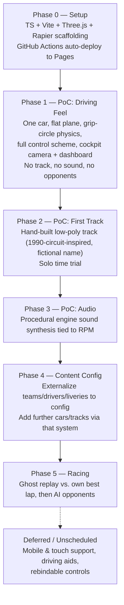

# Requirements Document: Low-Poly 1990 F1 Browser Racer

**Status:** Draft, agreed in requirements workshop
**Date:** 2026-07-13
**Type:** Hobby project

---

## 1. Vision

A browser-based, low-poly, pseudo-simulator Formula 1 racing game set in the character of the **1990 F1 season**: powerful, ground-effect-less, manual-gearbox cars that are hard to drive fast. The player sits in the cockpit (first-person driver view) and controls the car via keyboard input, with a simplified-but-genuine physics model standing in for full sim-grade tire/suspension modeling.

Visual style: flat-shaded, vertex-colored low-poly geometry — **no textures**. Cars are ~100–300 polygons; tracks are similarly minimal.

## 2. Motivation & Goals

- **Primary driver:** this is a hobby project used to gauge the effectiveness of AI-assisted ("native-ai") development.
- **Delivery style:** iterative, PoC-first. Each phase should be a small, cheap slice that produces something demonstrable and gathers feedback before the next phase is scoped.
- **Audience:** the developer, plus (potentially) a public audience if shared as a portfolio/process artifact. All content decisions below are made to keep public sharing safe (see §8).

## 3. Explicit Non-Goals (for now)

These were deliberately deferred, not rejected — they may become their own future phases:

- AI opponents / competitive racing
- Multiplayer
- Mobile/touch support
- Driving aids (ABS, traction control, etc.)
- Rebindable controls
- Licensed/real team, driver, or circuit names
- Recorded/licensed audio
- Formal test suite (revisit once logic complexity warrants it)

## 4. Technical Stack

| Concern | Decision |
|---|---|
| Rendering | Three.js (WebGL, flat-shaded/vertex-colored geometry, no textures) |
| Physics | Rapier (WASM), single-threaded build (avoids COOP/COEP hosting requirements) |
| Language | TypeScript |
| Build tool | Vite |
| Package manager | npm |
| Testing | None yet — revisit once game logic complexity justifies it |
| Hosting | GitHub Pages, static build |
| Repo | Public GitHub repository |
| CI/CD | GitHub Actions — auto-build & deploy to Pages on push/merge to `main`, from Phase 0 onward |

### Architecture overview

## 5. Physics & Driving Model

- **Engine:** Rapier, driving a simplified-but-real vehicle model — mass, weight transfer, momentum/inertia, collision response.
- **Grip model:** grip-circle (combined lateral + longitudinal grip budget per tire) — captures the "twitchy, easy to spin" character of 1990 F1 cars without full tire-model simulation.
- **Aerodynamics:** speed-squared downforce and drag, calibrated to real 1990-era figures (~2000kg downforce at 150mph). Downforce feeds tire grip algebraically (decoupled from suspension spring force, which stays deliberately stiff/short-travel); drag is a real applied force. See [phase-1-driving-feel.md](../plan/phase-1-driving-feel.md) retrospective.
- **Explicitly excluded (for now):** tire wear, fuel load, mechanical damage.
- **Gearbox:** sequential, manual. No clutch modeling required for normal up/down shifts.
- **Clutch:** modeled for standing starts (holding the clutch key allows revving without stalling/launching) and can also stall — dragging the engine rpm down too far under load (e.g. hard braking without clutching in) kills the engine, same as a real manual car; restart with the clutch held and the starter key (`t`).
- **Driving aids:** none in initial phases; may be added later as an option.

## 6. Controls

| Key | Action |
|---|---|
| `z` | Turn left (ramped analog response) |
| `x` | Turn right (ramped analog response) |
| `'` | Accelerate (ramped analog response) |
| `/` | Brake (ramped analog response) |
| `space` | Context-sensitive gear shift: **gear up** if currently accelerating, **gear down** otherwise |
| `shift` | Engage clutch (used for standing starts, and to restart a stalled engine) |
| `t` | Starter motor - restarts a stalled engine (requires clutch held) |

All digital key inputs are ramped toward their target value rather than applied instantly, to keep the grip-circle physics controllable.

## 7. Camera & HUD

- **View:** cockpit only (first-person, as the driver would see).
- **Instrumentation:** minimal low-poly analog dashboard, modeled as real 3D geometry in the cockpit (not a 2D overlay) — a rev counter needle and a gear-number indicator. This is the minimum needed to make sequential shifting playable.
- **No 2D HUD** (lap timer, speed, minimap, etc.) in initial phases — may be added later once lap timing/racing exist.

## 8. Content Strategy (Cars, Drivers, Tracks)

To keep the project IP-safe for public sharing while preserving the authentic 1990 F1 *feel*:

- **Teams & drivers:** fictional, with liveries and car silhouettes clearly inspired by 1990 F1 engineering character (high airbox, narrow slicks, era-accurate proportions) — not literal reproductions, no real names.
- **Customization:** team names, driver names, and liveries should be **externalized to a config file** so they're easily changed later. This is a deferred requirement (Phase 4), not needed for early PoCs.
- **Tracks:** hand-built, low-poly recreations of real 1990-era circuit *layouts and character* (corner sequence, elevation, general shape), given fictional names. Built from scratch (no laser scanning, no licensed track data) — avoids licensing issues while keeping real-circuit authenticity.

## 9. Game Loop / Race Structure

- **Initial mode:** solo time trial / free practice — drive a track alone.
- **Ghost replay:** racing against your own recorded best lap — a low-complexity stepping stone before real opponents.
- **AI opponents:** deferred to a distinct, later phase — genuinely hard problem (raceline logic, opponent physics/collision, race-craft behavior under a grip-circle model) that shouldn't block earlier phases.
- **Multiplayer:** not currently planned.

## 10. Performance & Platform Targets

- **Platform:** desktop only (keyboard-driven controls make mobile a non-goal for now).
- **Browsers:** latest evergreen Chrome, Edge, Firefox.
- **Frame rate target:** 60fps. Low-poly, no-texture rendering should make this easily achievable on any reasonably modern GPU without special optimization work.
- **No commitment** to low-end/old hardware support.

## 11. Audio

- **Deferred** to a later phase (after driving feel and a real track are proven).
- **Approach when tackled:** procedural engine sound synthesis via the Web Audio API, pitch/timbre tied to RPM — not recorded/licensed real engine samples, consistent with the "everything hand-built" approach used for visuals and content.

## 12. Deployment & CI/CD

- Public GitHub repository.
- GitHub Actions workflow: build (Vite) and deploy to GitHub Pages automatically on push/merge to `main`.
- Set up from **Phase 0**, not retrofitted later — needed to make delivery metrics (see §13) meaningful from day one.
- Rapier's single-threaded WASM build avoids the need for COOP/COEP headers, which GitHub Pages doesn't support natively.

## 13. Success Criteria / Evaluation Approach

Two intertwined tracks of "success":

1. **Game feel:** does each PoC deliver the intended feel/experience (validated informally by playing it)?
2. **AI-assisted delivery process** (primary personal motivation for the project): evaluated loosely through a **DORA-metrics-inspired lens**, made possible by the CI/CD setup in §12:
   - **Deployment frequency** — how often working changes reach the live GitHub Pages build.
   - **Lead time for changes** — how long from starting a change to it being live.
   - **Change failure rate / MTTR** — tracked informally (a personal note if something breaks), since low-stakes for a solo static-site hobby project.
   - At the end of each phase, a brief informal retrospective: how much was AI-driven vs. manually corrected, what worked well, what didn't.
   - No formal dashboard or scoring system — lightweight and personal.

## 14. Phase Roadmap

Phase boundaries are a guide, not a commitment — expected to shift as feedback from each PoC comes in.

## 15. Open Questions / Risks

- **Grip-circle tuning** is likely to be the highest-iteration item in Phase 1 — "feel" is inherently subjective and may take several passes.
- **Track-building workflow** (Phase 2) is not yet defined — e.g. hand-authored in a 3D tool vs. procedurally described in code. To be scoped at the start of that phase.
- **Config file format** for Phase 4 (JSON/YAML/TS module) not yet decided — low-risk, can be decided when that phase starts.
- **AI opponent behavior** under a grip-circle model (Phase 5) is an open, potentially hard problem — flagged for early investigation once that phase begins, rather than assumed solvable by default.

## 16. Next Steps

1. Scaffold the repository (Phase 0): TypeScript + Vite project, Three.js + Rapier dependencies, basic GitHub Actions workflow deploying an empty scene to GitHub Pages.
2. Confirm Phase 0 is live and deploying automatically.
3. Begin Phase 1 (driving-feel PoC): single car, flat plane, full control scheme, grip-circle tuning.
4. Informal retrospective at the end of Phase 1 before scoping Phase 2 in detail.
